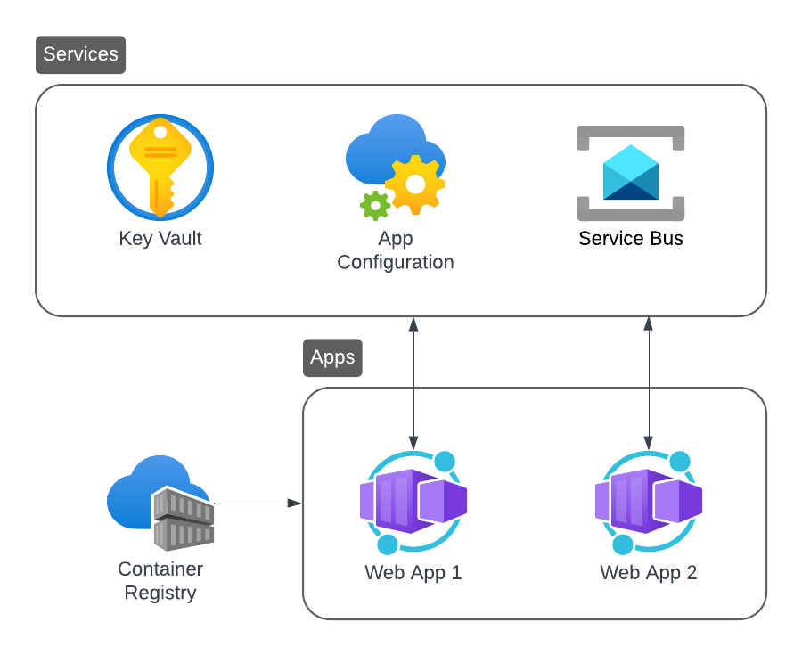

# Aspire Basic Template (Key Vault + App Config + Service Bus/RabbitMQ)
This repository contains an `azd` template that uses **Aspire** as the application orchestrator. The template includes:
- Azure Key Vault for app secrets
- Azure App Configuration for app settings
- Azure Service Bus or RabbitMQ for messaging
- two sample ASP.NET applications that use the above services

## 🏢 Architecture
The architecture of the template is depicted below:



The template supports both **local** and **hybrid** development mode (see below for details).

To enable this, messaging between apps is abstracted using [Rebus](https://github.com/rebus-org/Rebus) 🚌.

To prove connectivity to Azure Key Vault, the `WebApp1:AppKey` and `WebApp2:AppKey` secrets are used.

Similarly, for Azure App Configuration, the `WebApp1:AppName` and `WebApp2:AppName` settings are used.

You can create these using the portal or the following `az` commands:
```
az keyvault secret set `
    --vault-name <keyvault> `
    --name WebApp1--AppKey `
    --value MyAppKey1 `
    --output none
```
```
az appconfig kv set `
    --name <appconfig> `
    --key WebApp1:AppName `
    --value MyWebApp1 `
    --yes `
    --output none
```

The `bicep` template used to provision the Azure resources takes the following parameters:
- `environmentName`: corresponds to `AZURE_ENV_NAME` and is set by `azd`
- `location`: corresponds to `AZURE_LOCATION` and is set by `azd`
- `hybridEnvironment`: corresponds to `HYBRID_ENVIRONMENT` and must be set manually (can be either `true` or `false`)
- `principalId`: corresponds to `AZURE_PRINCIPAL_ID` and must be set manually (it's the ID of the developer, i.e. you)

The principal specified above will be given appropriate permissions to access the provisioned resources, e.g. create secrets in the key vault

## 🏠 Local Development
In this mode no resources are provisioned and all apps and services run locally:
- app secrets are stored in the project's user secrets
- app settings are stored in the project's `appsettings.Development.json`
- a RabbitMQ container, which includes the management portal, is used for messaging between the apps

Since no resources need to be provisioned, there are no pre-requisites to use local development:
- to run the application in Visual Studio, select the **Development** profile and hit F5
- in VS Code, use: `dotnet run --project .\src\AzdAspire.AppHost\AzdAspire.AppHost.csproj --launch-profile Development`

## 💻 Hybrid Development
In this mode only a few service resources are provisioned and all apps run locally:
- app secrets are stored in Azure Key Vault
- app settings are stored in Azure App Configuration
- Azure Service Bus is used for messaging between the apps

Hybrid development is enabled as follows:
- create a new `azd` environment using the command `azd env new <environment>`, where `<environment>` is your chosen environment name
- locate the newly created file `.azure\<environment>\.env` and append the line `HYBRID_ENVIRONMENT="true"`
- create the service resources by running `azd provision` (you can use the `--preview` flag to preview the changes without creating any resources)
- locate the `Production` profile in ['launchSettings.json'](src\AzdAspire.AppHost\Properties\launchSettings.json) in the Aspire host project
- in the above profile, set the `DOTNET_ENVIRONMENT` variable to `<environment>`
- to run the application in Visual Studio, select the **Production** profile and hit F5
- in VS Code, use: `dotnet run --project .\src\AzdAspire.AppHost\AzdAspire.AppHost.csproj --launch-profile Production`

## ☁️ Running in Azure
In this mode all the required resources are provisioned and all apps and services run in the cloud.

To create a fully provisioned runtime environment, follow these steps:
- create a new environment using the command `azd env new <environment>`
- create the service resources by running `azd provision`
- deploy the applications by running `azd deploy`
